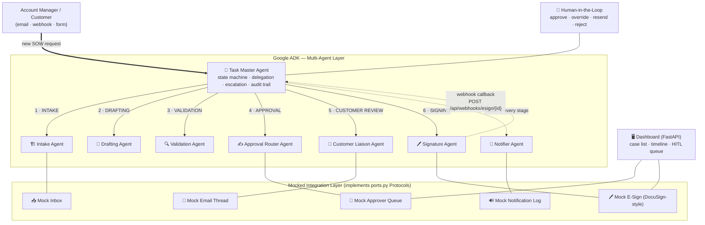
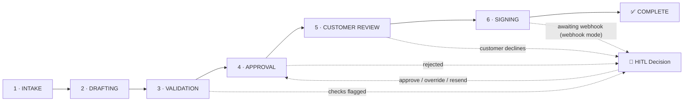

# 🧠 SOW-TaskMaster — Multi-Agent SOW Signing Automation

**Hackathon Track:** Task Master · **Stack:** Google ADK + Gemini · **Timeline:** 2 weeks · **Demo mode:** Mocked end-to-end, simulated integrations

SOW-TaskMaster is a **multi-agent system** that orchestrates the full Statement of Work (SOW) lifecycle — from customer project request to final signature — with humans only touched at **genuine decision points**. A **Task Master agent** owns the case state machine and delegates drafting, validation, approval routing, customer negotiation, signing, and notifications to supporting agents, each backed by a clean **mock integration** that is a one-file swap away from a real adapter.

> 🎯 **The demo story:** one believable, end-to-end run — intake → draft → validate → approve → redline round → sign — fully logged, resumable, explainable, and queryable in natural language. Every agent decision is recorded with its reasoning.

> 🚀 **🔴 LIVE NOW on Google Cloud Run:** try the deployed dashboard at **https://sow-taskmaster-122458747029.us-central1.run.app**
> — click **"Start demo case"**, then **"Simulate DocuSign webhook (sign now)"**. Full test + video-recording script: **[TESTING_GUIDE.md](./TESTING_GUIDE.md)**.

---

## Why this problem

The SOW signing process — from request to signature — runs largely over email with manual steps at each stage:

- 🔁 Slow turnaround (email back-and-forth, manual chasing)
- ❓ No single source of truth ("where is this SOW right now?")
- 🧾 Validation (commercial, timeline, delivery) done manually and inconsistently
- ⚠️ Risk of dropped threads, missed approvals, version confusion on drafts

**SOW-TaskMaster replaces the manual plumbing with an agentic orchestrator** — not one big LLM call, but a genuine multi-agent story: delegation, escalation, audit trail, and a human-in-the-loop queue.

---

## ⭐ Features (FR / NFR)

| | |
|---|---|
| ✅ **Case tracking** | Every request becomes a tracked case (`SOW-XXXXXXXX`) with a unique ID (FR1) |
| ✅ **Auto-extraction** | Intake agent pulls customer, project, budget, timeline from unstructured text (FR2) |
| ✅ **Template drafting** | SOW generated from a template + case data; versioned (FR3) |
| ✅ **Deterministic validation** | Commercial margin, timeline feasibility, capacity checks — each with pass/fail + reasoning (FR4, NFR1) |
| ✅ **Rule-based approval routing** | Deal value ≥ £50K → executive sign-off added (FR5) |
| ✅ **Simulated customer loop** | One full redline → revised draft → approval round (FR6) |
| ✅ **Queryable status** | "Where is SOW #123?" — CLI `--status`, dashboard, or natural-language `--query` (FR7) |
| ✅ **Human-in-the-loop** | Escalations block the case with a decision ID; resolve via `approve / override / resend / reject` (FR8) |
| ✅ **Simulated e-sign** | DocuSign-style webhook completes the case and files it (FR9) |
| ✅ **Explainability** | Full per-agent action timeline with reasoning, on console and dashboard (NFR1, FR10) |
| ✅ **Resumable state machine** | JSON-backed state per case; blocked cases continue from where they stopped (NFR2) |
| ✅ **Portable integrations** | All mocks implement `ports.py` Protocols — real adapters swap in cleanly (NFR3) |
| ✅ **Runs in minutes** | `python main.py` = full lifecycle; dashboard = one command (NFR4) |
---

## 🏗️ Architecture Diagram

### Agent graph — who delegates to whom



### Lifecycle — the resumable state machine



> 📄 **One-page printable PDF for slides:** [`docs/SOW-TaskMaster-Architecture.pdf`](./docs/SOW-TaskMaster-Architecture.pdf)
> Regenerate it any time with `python scripts/build_architecture_pdf.py`.


> **How ADK is used (honest architecture):** each agent is defined as a real Google ADK `LlmAgent` with its own role, model, instructions, and output key. When credentials are present (`USE_REAL_LLM=true`), Gemini runs `LlmAgent`s through an `InMemoryRunner` for the parts where an LLM adds demo value (intake field extraction, validation executive summaries, natural-language status queries). The **spine is deterministic** — the Task Master's state machine and rule checks never depend on the LLM, so the demo is reliable and explainable. This gives you a genuine multi-agent story for judges while keeping every run repeatable.

---

## 🤖 Agent Architecture

| Agent | Responsibility | Mocked Integration |
|---|---|---|
| **Task Master** (orchestrator) | Owns the case state machine; delegates to the right agent per stage; escalates to a human at genuine decision points; keeps the audit trail | — (deterministic orchestration) |
| **Intake Agent** | Parses the incoming request → structured fields (customer, project, scope, budget, timeline); flags missing info | `mocks/inbox.py` — simulated inbox/webhook |
| **Drafting Agent** | Generates a versioned SOW draft from `templates/sow_template.txt` + case data; re-renders after redlines | local template store |
| **Validation Agent** | Rule-based commercial (margin ≥ 15%) and delivery feasibility checks; pass/fail/flag with reasoning | `config.py` thresholds only (no external service) |
| **Approval Router Agent** | Route by deal value (≥ £50K → +VP sign-off); tracks responses | `mocks/approver_queue.py` — simulated approver queue |
| **Customer Liaison Agent** | Sends draft, parses replies, handles the redline/negotiation loop, confirms approval | `mocks/email.py` — simulated email thread |
| **Signature Agent** | Sends final doc for e-sign, confirms completion, files; webhook callback completes case | `mocks/esign.py` — mock DocuSign-style webhook |
| **Notifier Agent** | Status updates to stakeholders at every stage transition | `mocks/` notification log |
| **Query Agent** | Answers natural-language questions over the case store ("where is SOW #123?") | deterministic fallback + Gemini when enabled |
---

## 🗂️ Repository Structure

```
SOW-TaskMaster/
├── main.py                 # CLI entry point — demo, scenarios, HITL, query, serve
├── config.py               # All thresholds, stage order, LLM + signing settings
├── models.py               # Pydantic models: SOWCase, AgentAction, Escalation
├── state_store.py          # JSON file store per case (data/cases/<ID>.json)
├── ports.py                # Protocol interfaces for swapping mocks → real adapters
├── query_engine.py         # Natural-language "where is SOW #123?" (FR7)
├── web_app.py              # FastAPI: dashboard + HITL API + mock e-sign webhook
├── requirements.txt
├── .env.example            # Copy to .env for Gemini credentials (options A/B)
│
├── agents/                 # Google ADK agent definitions + agent functions
│   ├── task_master.py      #   Orchestrator: state machine, delegation, HITL
│   ├── intake_agent.py     #   Field extraction
│   ├── drafting_agent.py   #   Template-based SOW generation
│   ├── validation_agent.py #   Deterministic rule checks
│   ├── approval_router.py  #   Value-based routing
│   ├── customer_liaison.py #   Customer email + redline loop
│   ├── signature_agent.py  #   E-sign + filing
│   ├── notifier_agent.py   #   Status notifications
│   └── llm_utils.py        #   InMemoryRunner helpers (Gemini mode)
│
├── mocks/                  # Swappable mock services behind ports.py
│   ├── inbox.py            #   mock inbox/webhook receiver
│   ├── email.py            #   mock customer email thread
│   ├── approver_queue.py   #   mock approver responses
│   └── esign.py            #   mock DocuSign-style envelopes
│
├── templates/
│   └── sow_template.txt    # SOW document template
├── data/cases/             # Persisted case state (JSON) — gitignored
├── web/
│   └── dashboard.html      # Single-page agent control room
├── docs/
│   ├── SOW-TaskMaster-Architecture.pdf         # one-page printable architecture
│   └── SOW-TaskMaster-Architecture-preview.png # render used in this README
├── scripts/
│   └── build_architecture_pdf.py # regenerate docs/ outputs from README Mermaid
└── tests/
    ├── test_e2e_flows.py   # T1–T5 end-to-end regression (incl. webhook + HITL)
    ├── test_drafting_redline.py
    └── test_llm_utils.py
```

---

## 🚀 Setup

### 1. Prerequisites

- **Python 3.11+** (developed on 3.14)
- **Google ADK** + **google-genai** (see below)
- (Optional) a Gemini key / GCP project for real-LLM mode — **not required for the demo**

### 2. Install

```bash
git clone <your-repo-url> SOW-TaskMaster
cd SOW-TaskMaster
python -m venv .venv
# Windows:  .venv\Scripts\activate        macOS/Linux:  source .venv/bin/activate
pip install -r requirements.txt
# LLM-rich features (litellm, file readers) — only needed for real Gemini mode:
pip install google-adk[extensions]
```

### 3. Configure Gemini (optional — demo works without it)

Copy `.env.example` → `.env` and pick **one** option:

| Option | What to set |
|---|---|
| **A · Gemini Enterprise / Vertex AI** | `GOOGLE_GENAI_USE_ENTERPRISE=1`, `GOOGLE_CLOUD_PROJECT`, `GOOGLE_CLOUD_LOCATION`, then `gcloud auth application-default login` |
| **B · Gemini Developer API key** | `GEMINI_API_KEY=<your key from https://aistudio.google.com/app/apikey>` |

Then choose the LLM mode via `USE_REAL_LLM` in `.env`:

| Value | Behaviour |
|---|---|
| `auto` (default) | Real Gemini **iff** credentials detected, else mock |
| `true` | Force real Gemini (fails loudly if no credentials) |
| `false` | Force deterministic mock LLM — **recommended for the judging demo** |

### 4. Sanity-check the installation

```bash
python main.py --check-llm      # confirms which backend/model is wired up
python --version                # Python 3.11+
```
---

## ⚡ Quick Start (demo path)

### A. Full lifecycle, one command — mock mode

```bash
set USE_REAL_LLM=false          # Windows PowerShell
$env:USE_REAL_LLM = "false"     # (same thing)
python main.py                  # Intake → Draft → Validate → Approve → Redline → Sign → Complete
```

Watch the console narrate every stage: the six-stage state machine, the **redline round** (customer asks for extended warranty → draft re-rendered at v2 → approved), the e-signature, and then the **full explainability timeline** (every agent action + reasoning).

### B. Executive-approval path (high-value deal)

```bash
python main.py --scenario high
```

The £120K request routes to **two approvers** (`delivery_manager` + `vp_delivery`) instead of one — proving the value-based routing rule (≥ £50K).

### C. Human-in-the-loop decision queue

```bash
# create a case that *blocks* on a human decision, then resolve it:
python main.py --list            # find a blocked case
python main.py --blocked         # list everything awaiting a human
python main.py --resolve SOW-XXXX approve "reason here"   # approve | override | resend | reject
```

### D. Dashboard + simulated DocuSign webhook

```bash
set SIGNING_MODE=webhook         # case parks at "awaiting_signature" after signing
$env:SIGNING_MODE = "webhook"
python main.py --serve           # → http://127.0.0.1:8080
```

Click **"Start demo case"**, watch it flow through every stage in ~4 seconds of auto-refresh, then click **"Simulate DocuSign webhook (sign now)"** → the case completes. The dashboard also surfaces **blocked (HITL)** cases with Approve/Override/Reject/Resend buttons and a **natural-language query** box.

### E. Status anywhere ("where is SOW #123?")

```bash
python main.py --list
python main.py --status SOW-XXXX
python main.py --query "where is SOW-XXXX right now?"
python main.py --query "how many cases are complete?"
```

---

## ⌨️ CLI Reference

| Command | What it does |
|---|---|
| `python main.py` | Full lifecycle demo with the sample £45K request (auto-signing mode) |
| `python main.py --scenario high` | High-value £120K deal → executive approval path |
| `python main.py --custom` | Paste your own request interactively |
| `python main.py --list` | All cases + statuses + 🔶HITL markers |
| `python main.py --status <ID>` | Detail + recent activity for a case |
| `python main.py --blocked` | Every case awaiting a human decision |
| `python main.py --resolve <ID> <decision> [notes]` | `approve` / `override` / `resend` / `reject` a blocked case |
| `python main.py --query "<question>"` | Natural-language question over all cases (FR7) |
| `python main.py --check-llm` | Verify Gemini credentials/model wiring |
| `python main.py --serve` | Run the FastAPI dashboard + API + e-sign webhook |

### Dashboard API (also handy for the demo)

| Endpoint | Purpose |
|---|---|
| `GET /api/health` | Health + current LLM mode/model |
| `GET /api/cases?stage=&status=` | Case list + status counts |
| `GET /api/cases/{id}` | Full case incl. timeline |
| `POST /api/cases/start` | Start a demo case |
| `POST /api/cases/{id}/resolve` | HITL decision: `approve`/`override`/`resend`/`reject` |
| `POST /api/webhooks/esign/{id}` | **Simulated DocuSign webhook callback** |
| `POST /api/query` | `{"question": "..."}` → natural-language answer |
---

## 🎬 Demo Script (≈ 4–5 minutes, prepped for judges)

**Setup before the demo (do this in advance):**
1. Terminal A ready at the repo root with `USE_REAL_LLM=false` exported.
2. Terminal B: `SIGNING_MODE=webhook` + `python main.py --serve` → dashboard open on http://127.0.0.1:8080.
3. Clear `data/cases/` if you want a clean starting board (or keep prior cases to show "where is SOW #123?").

| ⏱ | What you do | What you say (theme) |
|---|---|---|
| 0:00 | Show `README.md` diagram / one-slide architecture | "One orchestrator, seven supporting agents, clean mock boundaries." |
| 0:15 | `python main.py --scenario high` | "Watch a £120K request end-to-end. The key moment is the approval step — our value-based routing upgrades a large deal to an executive approver." |
| 1:00 | Point at the **redline round** in the console | "The customer comes back wanting a 24-month warranty instead of 12. The Task Master doesn't panic — a single negotiation round, a v2 draft, and the customer approves. Humans were never touched." |
| 1:45 | Scroll the **agent action timeline** | "Every agent logs what it did *and why* — explainability for audit, and for you." |
| 2:15 | Switch to the browser dashboard | "Now the human side — the control room. Click **Start demo case** → the case parks at `awaiting_signature` because we set `SIGNING_MODE=webhook`. This is our DocuSign-shaped seam." |
| 3:00 | Click **"Simulate DocuSign webhook (sign now)"** | "The mock e-signature platform calls back our webhook — exactly how DocuSign would in production. The case completes and kicks off project kickoff. One line of config changes webhook mode from 'sign immediately'." |
| 3:30 | (If any blocked cases) open one | "This is the human-in-the-loop — not every decision belongs to an agent. The case carries a decision ID, and a human's approve/override/reject is recorded in the audit trail. Production catch: real approvals would go through Slack/Jira." |
| 4:00 | `python main.py --query "how many cases are complete?"` | "And the same state store that runs the agents also answers natural-language questions — this is FR7 in production wording: *where is this SOW right now?*" |
| 4:30 | Field any questions | see Q&A notes below |

**Demo red flags — know these by heart:**
- Validation is **deterministic, not LLM judgement** — "pass/fail belongs to rules, not vibes; the LLM only writes an executive summary around the same numbers."
- Mocks are **in-process** — "the entire lifecycle runs in one process for reproducibility; in production each adapter is a separate service behind the same Protocol."

---

## 🧾 Mocked vs Real — the honesty table

| Integration | Mock (what ships in this repo) | Real-world swap (same Protocol) |
|---|---|---|
| **Inbox / intake** | `MockInbox.receive_request()` — struct with sender/subject/body | IMAP/Gmail push, SOW webhook, or CRM form → `receive_request()` |
| **Customer email** | `MockEmailThread` — scripted first-redline-then-approve simulation | Gmail/Outlook/Procore email API with webhook reply parsing |
| **Approver queue** | `MockApproverQueue` — scripted `approve` responses | Slack/Teams approval app or Jira workflows (async, multi-participant) |
| **E-signature** | `MockESign` — in-memory envelopes; dashboard endpoint simulates the DocuSign callback | DocuSign / HelloSign / AdobeSign: envelope + signed webhook + certificate of completion |
| **Notification** | Log entries on the case timeline | Slack / email / Microsoft Teams webhooks, with delivery receipts |
| **State store** | JSON files in `data/cases/` | Dockerized SQLite/Postgres with migrations; same `StateStore` interface |
| **LLM (drafting, intake, query)** | Deterministic mock (regex extraction, template fill, rule fallback) | Gemini via ADK `LlmAgent` + `InMemoryRunner` (`USE_REAL_LLM=true`) |
| **Web UI** | Single-page dashboard (FastAPI + static HTML/JS) | Same API; swap the frontend for an internal portal |

**Why this matters for judges:** NFR3 stands — swap any `MockX` for a real adapter implementing the same `Protocol` in `ports.py`; the Task Master and case state machine never change.
---

## 🧪 Tests

```bash
python tests\test_e2e_flows.py      # T1–T5: full lifecycle, webhook, 409 replay,
                                    #   HITL override, query engine (17+ assertions)
python tests\test_drafting_redline.py
python tests\test_llm_utils.py
```

The e2e suite covers the failure paths judges love to poke at:
- **T2/T3** — webhook signing, duplicate-envelope regression, lost-envelope **HTTP 409** with replay.
- **T4** — a rejected request escalates to a human, gets overridden, and completes.

---

## 🎛️ Configuration (`config.py`, tweak for your story)

| Setting | Default | Meaning |
|---|---|---|
| `APPROVAL_THRESHOLD_GBP` | `50_000` | Deal value at/above → executive approver added (FR5) |
| `STANDARD_APPROVERS` / `EXECUTIVE_APPROVERS` | `delivery_manager` / `+ vp_delivery` | Approval routing lists |
| `MIN_MARGIN_PERCENT` | `15.0` | Commercial check threshold (cost modelled as 70% of budget) |
| `MAX_DELIVERY_WEEKS` | `26` | Timeline feasibility cap |
| `WEEKS_PER_10K_GBP` | `1.0` | Capacity rule: weeks needed vs budget |
| `CUSTOMER_FIRST_RESPONSE` / `SECOND_RESPONSE` | `redline` / `approve` | Scripted negotiation loop (exactly one round) |
| `SIGNING_MODE` | `auto` | `auto` = sign immediately; `webhook` = park & wait for DocuSign callback |
| `USE_REAL_LLM` | `auto` | `auto`/`true`/`false` — see Setup |
| `GEMINI_MODEL` | `gemini-2.5-flash` | Model for real-LLM agent runs |
| `WEB_HOST` / `WEB_PORT` | `127.0.0.1` / `8080` | Dashboard |

---

## 🎯 FR / NFR Coverage — at a glance

| Requirement | Where |
|---|---|
| FR1 tracked case w/ unique ID | `TaskMaster.create_case()` |
| FR2 auto-extract structured data | `agents/intake_agent.py` |
| FR3 auto-generate draft from template | `agents/drafting_agent.py` + `templates/sow_template.txt` |
| FR4 validation pass/fail/flag w/ reasoning | `agents/validation_agent.py` |
| FR5 route by rules (deal size) | `agents/approval_router.py` + `config.APPROVAL_THRESHOLD_GBP` |
| FR6 simulate customer loop incl. redline | `agents/customer_liaison.py` + `mocks/email.py` |
| FR7 query status any time | `main.py --status`, dashboard, `query_engine.py` |
| FR8 elevate to human HITL UI | `agents/task_master.escalate()` + `/api/cases/{id}/resolve` |
| FR9 simulate signature & complete | `agents/signature_agent.py` + `POST /api/webhooks/esign/{id}` |
| FR10 dashboards/timeline of all agents | `web/dashboard.html` + `GET /api/cases/{id}` |
| NFR1 every decision logged w/ reasoning | `SOWCase.log_action()` — full timeline |
| NFR2 resumable state machine | `run_lifecycle_from()` + JSON `StateStore` |
| NFR3 swappable mocks | `ports.py` Protocols + `mocks/` |
| NFR4 end-to-end in minutes | `python main.py` / one dashboard click |

---

## ☁️ Cloud Deployment (Google Cloud Run)

The system deploys as a single container via cloud-native build — **no local Docker required**.

```bash
# 1. One-time: point gcloud at your project + enable APIs
gcloud config set project my-agent-learning-project-01
gcloud services enable run.googleapis.com cloudbuild.googleapis.com artifactregistry.googleapis.com

# 2. One-time: grant the default compute SA build/storage/registry roles (owner not assumed)
#    gcloud projects add-iam-policy-binding my-agent-learning-project-01 \
#      --member="serviceAccount:<PROJECT_NUMBER>-compute@developer.gserviceaccount.com" \
#      --role=roles/cloudbuild.builds.builder   (also storage.objectAdmin, artifactregistry.writer)

# 3. Deploy from the repo root (Dockerfile provided) — live Gemini config:
gcloud run deploy sow-taskmaster --source . --region us-central1 \
  --allow-unauthenticated --max-instances=1 \
  '--set-env-vars=USE_REAL_LLM=true,GEMINI_MODEL=gemini-2.5-flash,GOOGLE_GENAI_USE_ENTERPRISE=1,GOOGLE_CLOUD_PROJECT=my-agent-learning-project-01,GOOGLE_CLOUD_LOCATION=us-central1,SIGNING_MODE=webhook,WEB_HOST=0.0.0.0'
```

Notes for judges:
- `USE_REAL_LLM=true` + the Vertex backend (`GOOGLE_GENAI_USE_ENTERPRISE=1` + project/location) → the
  deployed agents make **live Gemini calls** for intake extraction, SOW drafting, customer-email
  composition and natural-language queries. Validation stays deterministic/rule-based by design.
- Auth is Application Default Credentials from the runtime service account (needs
  `roles/aiplatform.user` + the AI Platform API enabled) — **no API key is baked into the container**.
- Model is `gemini-2.5-flash`: `gemini-3.5-flash` is not served on Vertex `us-central1` for this
  project (404); this was verified with `scripts/probe_models.py`.
- `SIGNING_MODE=webhook` → the case parks at `awaiting_signature` until the simulated DocuSign callback
  (`POST /api/webhooks/esign/{id}`) completes it.
- `--max-instances=1` keeps the in-process mock e-signature envelope available to the dashboard's
  "Simulate DocuSign webhook" button. Cloud Run state is ephemeral — click **Start demo case** each run.
- LLM calls add a few seconds per stage; a full case run takes ~30–60s (vs ~5s in mock mode).
- To run fully offline/deterministic (no Vertex dependency): redeploy with `USE_REAL_LLM=false`.

---

## 📌 What's next (post-hackathon)

1. Real adapters: Gmail/IMAP inbox → `InboxPort`; DocuSign → `ESignPort`; Slack approvals → `ApproverPort`.
2. Swap JSON files for DB-backed state (same interface).
3. Multi-cloud deployment: single ADK agent set, containerised services.
4. Persist decision queue to a real queue (Pub/Sub / SQS) instead of in-process mock.

---

*Built for the **Task Master** hackathon track with Google ADK + Gemini. See [`PITCH_SCRIPT.md`](./PITCH_SCRIPT.md) for the full narrated pitch.*